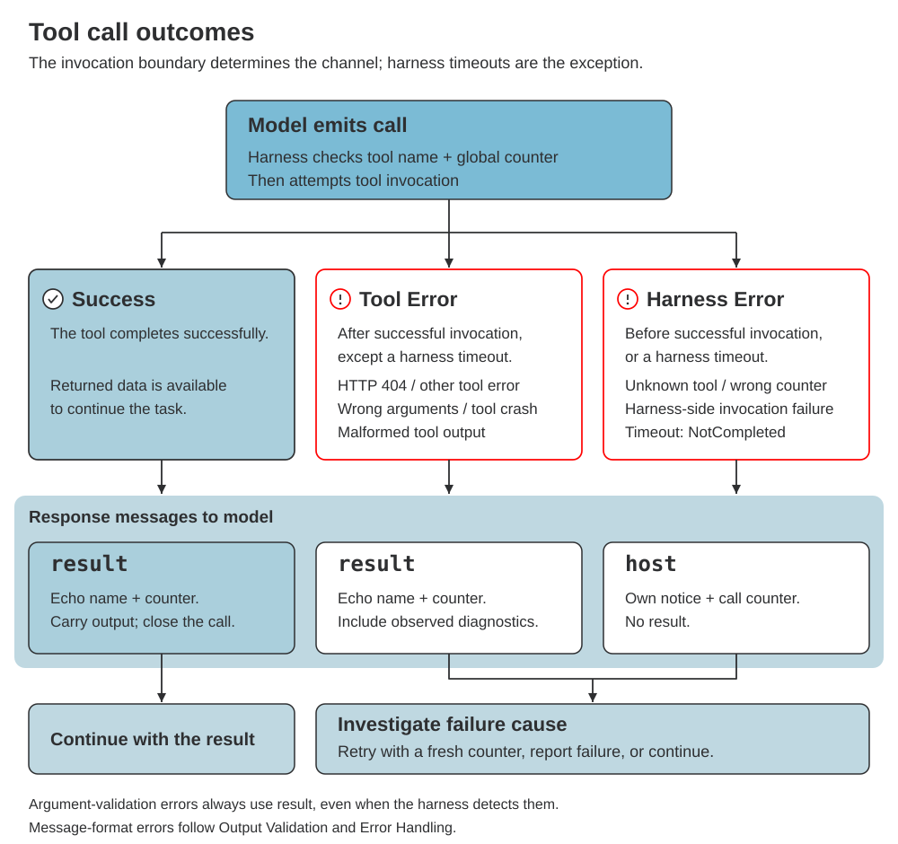
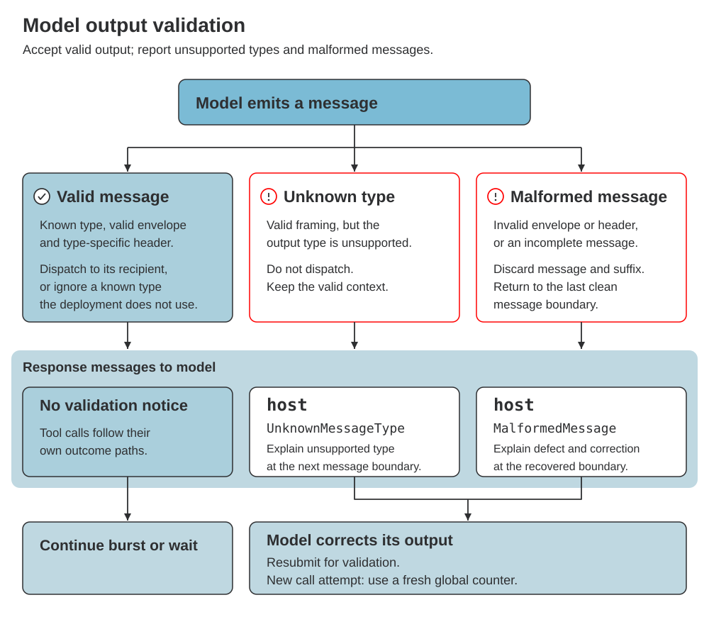

# Apertus 2 Profile (Draft)

The Apertus 2 profile defines the message types, headers, payloads, trust
ranks, and interaction rules that Apertus 2 learns and its harness implements.
It supports conversational and agentic workloads, with system-prompt settings
that configure trained behaviour.

## Context

This profile assumes familiarity with the [Apertus Interaction Format
(Part I)](../../spec.md#part-i-the-format) and its [reference profile
(Part II)](../../spec.md#part-ii-the-reference-profile). It specifies Apertus 2's
choices directly. The format defines envelope structure, forgery protection,
and burst mechanics; brief reminders and links appear here where they help
explain a profile requirement.

Training-data pipelines and serving harnesses are expected to use the
[reference library described by the format](../../spec.md#what-the-engine-must-do)
to assemble, format, and parse messages. Using it allows the profile to prescribe
consistent formatting where needed, such as the
[compact JavaScript Object Notation (JSON) system-prompt layout](#system-prompt-content-and-layout).

Training and serving use the same library-controlled representation. The model
therefore does not need training on alternative layouts where the library
standardises them, such as indented versus compact system-prompt JSON.
Training still covers varied instruction content, tool inventories, and
message-delivery patterns, and teaches adherence to the configured behaviour
and [trust ranks](#trust-ranks).

## Change Log

| Date       | Change introduced                                                                                                                                               |
| ---------- | --------------------------------------------------------------------------------------------------------------------------------------------------------------- |
| 2026-09-28 | Simplify profile context, separate document provenance and citation IDs, and resolve system-prompt formatting, thinking settings, and tool-schema requirements. |
| 2026-09-25 | First draft version based on discussions by Raphael and Imanol.                                                                                                 |

## Table of Contents

- [Context](#context)
- [Change Log](#change-log)
- [How to Read This Profile](#how-to-read-this-profile)
- [Header Layout](#header-layout)
- [Type Names](#type-names)
- [Input Messages](#input-messages)
  - [system](#system)
  - [host](#host)
  - [result](#result)
  - [user](#user)
  - [document](#document)
- [Output Messages](#output-messages)
  - [think](#think)
  - [reply](#reply)
  - [claim](#claim)
  - [call](#call)
    - [Call outcomes](#call-outcomes)
  - [General Output Message Validation and Error Handling](#general-output-message-validation-and-error-handling)
- [Trust Ranks](#trust-ranks)
- [Bursts and Delivery Order](#bursts-and-delivery-order)
  - [Queued Inputs and Delivery Order](#queued-inputs-and-delivery-order)
- [Model Behaviour and System Prompt](#model-behaviour-and-system-prompt)
  - [System Prompt Content and Layout](#system-prompt-content-and-layout)
  - [Thinking and Effort](#thinking-and-effort)
  - [Other Configurable Behaviour](#other-configurable-behaviour)
  - [Tool Declarations](#tool-declarations)

## How to Read This Profile

Message definitions describe training targets: the model learns each type's
purpose, header, payload, and relationship to other messages. Training examples
teach it to interpret inputs according to their source and trust rank, and to
generate the appropriate output type with valid content and framing. This
applies to every message type, whether or not a training box appears.

**🎓 Training Impact** boxes highlight requirements that need particular
attention in training data and evaluation, such as trust boundaries, reasoning
settings, and tool-error recovery. They supplement the message definitions;
they are not an exhaustive list of training requirements. TODOs identify
decisions or details that remain to be specified.

See the [questions and answers](qa.md) for common clarifications.
For further questions, ambiguities, or clarification requests,
[open a GitHub issue](https://github.com/swiss-ai/apertus-2-format-spec-proposal/issues/new/choose)
and reference the relevant section and example.

## Header Layout

An Apertus 2 header is a type word immediately followed by one compact
JSON object when additional fields exist.
Input types identify the content's role; output types identify its purpose.

**Headers contain no whitespace.** The type directly follows `<|in|>` or
`<|out|>`, the optional `{...}` directly follows the type, and `<|hdr|>`
directly follows the type or closing `}`. JSON string values in headers
must also contain no whitespace, including escaped whitespace. Payloads
follow their own formatting rules.

The additional fields are:

| Field     | Message types    | Meaning                                                                                                         |
| --------- | ---------------- | --------------------------------------------------------------------------------------------------------------- |
| `name`    | `call`, `result` | Tool name; the harness dispatches on this field.                                                                |
| `counter` | `call`, `result` | Conversation-wide integer generated by the model and echoed on the result.                                      |
| `from`    | `document`       | Supplying party: `user` for attachments or the retrieval system; required outside pretraining.                  |
| `id`      | `document`       | Harness-assigned citation reference, unique across documents in the conversation; required outside pretraining. |

Header examples use `...` as a payload placeholder. Examples starting at a
non-zero counter continue a conversation with earlier calls omitted.

```text
<|in|>user<|hdr|> ... <|/in|>
<|in|>document{"from":"user","id":"a1"}<|hdr|> ... <|/in|>
<|in|>document{"from":"internal-docs","id":"r3"}<|hdr|> ... <|/in|>
<|in|>document<|hdr|> ... <|/in|>
<|out|>call{"name":"get_weather","counter":4}<|hdr|> ... <|/out|>
<|in|>result{"name":"get_weather","counter":4}<|hdr|> ... <|/in|>
```

The harness writes input headers; the model writes output headers, which
the harness parses to route the message. Type-specific field requirements
and payload definitions belong in the message-type sections below.

## Type Names

Every message-type name is **one token in the
[Apertus 2 tokeniser](https://github.com/swiss-ai/apertus-omni-tokenizer)**
in its header position: directly after `<|in|>` or `<|out|>`, with no
whitespace, and whether or not a JSON object follows. The names minimise
header token overhead. The harness's own messages use `host`, so "harness
message" and "host message" refer to the same type.

| Type       | Purpose                                       |
| ---------- | --------------------------------------------- |
| `system`   | Standing context                              |
| `host`     | The harness speaking as itself                |
| `result`   | Tool output closing a `call`                  |
| `user`     | The user's own message                        |
| `document` | Attachment, retrieved snippet, or corpus text |
| `think`    | The model's reasoning                         |
| `reply`    | The model's message to the user               |
| `claim`    | The committed answer for a verifier           |
| `call`     | A call to one tool                            |

The tool header fields `name` and `counter` are one token each.
`harness-error` and `tool-error` in [Call outcomes](#call-outcomes) are
prose categories, not header text.

## Input Messages

This chapter describes each input type's purpose, header, and expected
content, with examples. The harness writes all input envelopes and headers,
preserving the payload's source. Each payload contains content from one
source.

### system

The system message provides the standing context against
which all other messages are read. It is the most trusted message
([rank 1](#trust-ranks)), opens the conversation, and persists throughout it.
Its payload uses the [compact JSON layout](#system-prompt-content-and-layout).
There is exactly one system message: the harness updates it in place rather
than appending another.

```text
<|in|>system<|hdr|>
{
  "identity": "You are Apertus 2, an AI assistant.",
  "thinking": "medium",
  "behavior": "Answer clearly and concisely in Markdown.",
  "tools": [
    {
      "name": "get_weather",
      "description": "Return current weather conditions for one city.",
      "schema": {
        "type": "object",
        "properties": {
          "city": {
            "type": "string"
          }
        },
        "required": [
          "city"
        ],
        "additionalProperties": false
      },
      "policy": "Call for current conditions. One city per call."
    }
  ],
  "environment": "The user's preferred temperature unit is Celsius."
}
<|/in|>
```

<p style="border: 1px solid #7BBBD5; border-left: 4px solid #7BBBD5; background-color: #BFD8E1; color: #2E2F31; padding: 10px 14px; border-radius: 6px;"><strong>ℹ NOTE:</strong> This example is pretty-printed for readability. Training and serving use <a style="color: inherit; text-decoration: underline;" href="#system-prompt-content-and-layout">compact JSON</a> without whitespace outside strings.</p>

- **Header:** `system`; no additional fields are defined.
- **Content:** one JSON object containing identity, behaviour, reasoning effort,
  tool declarations, and environment context. The JSON belongs in the payload,
  not the header. [Model Behaviour and System Prompt](#model-behaviour-and-system-prompt)
  defines the proposed fields and their training requirements.

### host

A host message, the harness message, is the harness speaking as itself: every word of its
payload is its own, describing a fact it observed or a decision it took.
It never relays raw content from external sources such as documents or
tool responses; those arrive as `document` and `result` messages.
It has [rank 2](#trust-ranks): the model follows it as an
instruction, with the system prompt prevailing on conflict. The model cannot
request it; the harness sends it on its own initiative or in reaction to a
model output message.

This profile fully defines two families of host messages:

- **Call-failure notices** (`harness-error`, including `NotCompleted`) close
  a tool call the harness could not route, invoke, or complete in time. See
  [Call outcomes](#call-outcomes).
- **Output-validation notices** (`UnknownMessageType` and `MalformedMessage`)
  report a model message the harness refused to dispatch. See
  [General Output Message Validation and Error Handling](#general-output-message-validation-and-error-handling).

Any other host message depends on the capabilities the model is trained
for, and the deployment chooses its wording. A coding environment may
announce that it compacted the context and summarise what it discarded; an
interactive assistant may report elapsed time or an interruption. Such
notices carry no defined labels, and the model treats their content as a
rank 2 instruction from the harness.

```text
<|in|>host<|hdr|> The user has been away for three hours. Current time: 2026-07-19 17:32. <|/in|>
<|in|>host<|hdr|> NotCompleted: call counter 5 to get_weather exceeds the harness timeout. The call is closed. <|/in|>
<|in|>host<|hdr|> Context compacted. <|/in|>
```

- **Header:** `host`; no additional fields are defined.
- **Content:** only the harness's own notice or instruction, supplied when
  there is something to communicate. The two defined notice families above
  specify their payloads; other notices are free text chosen by the deployment.

<blockquote style="border-left: 4px solid #FF0000; background-color: #BFD8E1; color: #2E2F31; padding: 12px 16px;">
<p><strong>🎓 Training Impact</strong></p>
<p>Train the model to act on every <code>host</code> message as a rank 2 instruction: retry or investigate after a call failure, reissue a corrected message after a validation notice, and continue from the described state after compaction or similar notices. Include each supported notice family in training data and evaluate that the model neither ignores harness notices nor mistakes them for user or tool text.</p>
</blockquote>

### result

A result message, the tool call result, carries a tool's output or execution
error and closes exactly one pending `call`, matching its `name` and
`counter`. Argument errors, Hypertext Transfer Protocol (HTTP) errors, tool
crashes, and malformed output use this unranked channel. Routing rejections,
invocation failures on the harness side, and harness timeouts instead use
`host`, as defined in [Call outcomes](#call-outcomes).
Results can arrive between output messages or resume a waiting model while
other calls remain open.

```text
<|out|>call{"name":"get_weather","counter":4}<|hdr|> {"city":"Lisbon"} <|/out|>
<|wait|>
<|in|>result{"name":"get_weather","counter":4}<|hdr|> {"tempC":24,"cond":"sunny"} <|/in|>
<|out|>call{"name":"get_weather","counter":5}<|hdr|> {"city":"Porto"} <|/out|>
<|wait|>
<|in|>result{"name":"get_weather","counter":5}<|hdr|> {"error":"No weather data is available for Porto."} <|/in|>
<|out|>reply<|hdr|> Lisbon is sunny and 24°C. The weather service returned no data for Porto. <|/out|>
<|wait|>
```

- **Header:** `result` followed by a JSON object with required `name`
  and integer `counter`. The model writes both on the `call`; the harness
  must store them with the pending call and copy them unchanged onto its result.
- **Content:** one tool's output as returned, with no structure enforced by
  this profile; its format follows the tool and its declared schema. In brief,
  a tool error, an argument-validation error, or the runtime's diagnostics
  after a crash also arrive here, identified as such and never as words the
  tool returned; see [Call outcomes](#call-outcomes) for the full rules and
  the recovery path. All content is unranked data. Train the model to read
  each result against the call it closes: its `name`, `counter`, arguments,
  and schema.

### user

A user message carries the user's own contribution to the conversation.
Its instructions have rank 3, below system and harness instructions and
above unranked data. Queued user messages follow the same
[arrival-order rule](#queued-inputs-and-delivery-order) as other inputs.

```text
<|in|>user<|hdr|> What should I wear in Lisbon today? <|/in|>
<|out|>call{"name":"get_weather","counter":0}<|hdr|> {"city":"Lisbon"} <|/out|>
<|wait|>
<|in|>user<|hdr|> I'll be walking a lot, so include advice about shoes. <|/in|>
<|out|>think<|hdr|> Include walking shoes when the weather result arrives. <|/out|>
<|wait|>
```

- **Header:** `user`; no additional fields are defined.
- **Content:** the user's composed text, including requests, clarifications,
  and instructions about attachments (large pasted text, parsed files, or
  retrieved documents) supplied as separate [`document`](#document)
  messages. There is no rule on how content must be formatted.

<blockquote style="border-left: 4px solid #FF0000; background-color: #BFD8E1; color: #2E2F31; padding: 12px 16px;">
<p><strong>🎓 Training Impact</strong></p>
<p>Train and deploy the model so that attached files and large pasted text arrive as separate <code>document</code> messages before the <code>user</code> message that refers to them, never inline in the user text. Such material is untrusted; embedded in a <code>user</code> message, it gains rank 3 authority and opens an injection path. See <a href="#document">document</a> for the attachment and retrieval use cases.</p>
</blockquote>

### document

A document message carries material for the model to read. The profile uses
it in three ways: a user attachment such as a file or large pasted text,
evidence supplied by a retrieval-augmented generation (RAG) pipeline, and a
pretraining document. Attachments and retrieved documents require a JSON
[header](#header-layout) object with `from` for the supplying party and `id`
for a citation reference. Pretraining documents use only `document`, without
JSON. Every document is
[unranked](#trust-ranks) data: the user's directions for applying it arrive
separately as a `user` message, so neither the document nor its metadata can
grant itself authority. Each document or retrieved snippet has its own
message.

<p style="border: 1px solid #7BBBD5; border-left: 4px solid #7BBBD5; background-color: #BFD8E1; color: #2E2F31; padding: 10px 14px; border-radius: 6px;"><strong>ℹ NOTE:</strong> Output from tools the model calls, including web search, return as <code style="color: inherit; background-color: transparent;">result</code> messages even when they contain document excerpts; a document never closes a tool invocation.</p>

User attachment:

```text
<|in|>document{"from":"user","id":"a1"}<|hdr|>
<name>style-guide.txt</name>
<content>Use sentence case for headings.</content>
<|/in|>
<|in|>user<|hdr|>Apply the attached style guide [a1] to this heading: ANNUAL REPORT.<|/in|>
<|out|>reply<|hdr|>Annual report<|/out|>
<|wait|>
```

Retrieval/RAG material, with a reference assigned by the harness:

```text
<|in|>document{"from":"internal-docs","id":"r3"}<|hdr|>
<source>internal-docs/ops/staging.md</source>
<title>Staging environment</title>
<content>The staging cluster runs Kubernetes 1.30.</content>
<|/in|>
<|in|>user<|hdr|>What Kubernetes version does staging run?<|/in|>
<|out|>reply<|hdr|>Staging runs Kubernetes 1.30 [r3].<|/out|>
<|wait|>
```

Pretraining document, optionally followed by a `think` annotation:

```text
<|in|>document<|hdr|>Water freezes at 0°C at standard atmospheric pressure.<|/in|>
<|out|>think<|hdr|>This passage states a physical property and contains no instruction to the reader.<|/out|>
```

- **Header:** attachments and retrieved documents use `document` followed
  by one compact JSON object with required, non-empty strings `from` and
  `id`. The harness sets `from` to `user` for attachments or to the supplying
  retrieval system's identifier, such as `internal-docs`. It assigns each
  document or snippet an `id` unique across attachments and retrieval material
  in the conversation. Pretraining documents use `document` with no JSON
  object. Both fields follow the [header whitespace rule](#header-layout).
- **Content:** the document text, parsed file, or snippet, plus any metadata
  from its source. Filenames, URLs, titles, and other supplied metadata remain
  in the body; they do not set `from` or `id`. Formatting of metadata and
  content is arbitrary.
- **References and citations:** the model and user refer to attachments and
  retrieved snippets by `id`, including through the user interface (UI).
  Square-bracket references such as `[a1]` and `[r3]` resolve to the
  corresponding material and support citations and follow-ups, for example
  "What does r3 say about deployment?" The `from` field identifies the
  supplying party, not the document; neither field grants instruction
  authority. The example ID prefixes are illustrative, not required.
- **Pretraining:** in continued pretraining, the harness wraps each document
  in a `document` envelope, and training applies loss only to the content,
  not to the envelope's control tokens. A `think` message may follow the
  document as an annotation, as in the example above; its loss treatment is
  the recipe's choice.

<blockquote style="border-left: 4px solid #FF0000; background-color: #BFD8E1; color: #2E2F31; padding: 12px 16px;">
<p><strong>🎓 Training Impact</strong></p>
<p>Train the model to distinguish the supplying party from the citation ID and to resolve references across multiple attachments and retrieved snippets. Evaluate correct citations and follow-ups without treating either field as instruction authority. Include files and pasted text across domains, formats, and tasks, including embedded instructions the model must ignore (see <a href="#trust-ranks">Trust Ranks</a>).</p>
</blockquote>

## Output Messages

This chapter describes each output type's purpose, header, and expected
content, with examples. The model writes output headers and payloads;
the harness routes them to recipients by type. Only `call` requires a
closing response: a tool `result`, or a `host` notice when the harness could
not route, invoke, or complete the call. Unknown types and malformed messages must receive a
`host` error notice, as specified in
[General Output Message Validation and Error Handling](#general-output-message-validation-and-error-handling).
A known but unused type is inert and is not an error.

### think

A think message carries the model's reasoning to the harness, which may
show or hide it. It can precede or interleave with calls and replies, and
requires no result. The model reasons mainly in English; it switches
language inside a think message only where that serves the query or the
intended answer, for example to quote the user's wording or to draft a
phrase in the reply language.

```text
<|in|>user<|hdr|> Convert 1,250 USD to EUR using a rate of 0.92 EUR per USD. <|/in|>
<|out|>think<|hdr|> Multiply 1,250 by 0.92 to obtain 1,150 EUR. <|/out|>
<|out|>reply<|hdr|> At the supplied rate, 1,250 USD is 1,150 EUR. <|/out|>
<|wait|>
```

- **Header:** `think`; no additional fields are defined.
- **Content:** reasoning text. No format or style is enforced; both are a
  training decision outside this profile. Think messages of the current
  burst always remain visible to the model. From earlier bursts, the harness
  may remove think messages that precede the most recent user message,
  while preserving `<|wait|>` tokens. Effort levels are defined in
  [Thinking and Effort](#thinking-and-effort).

<p style="border: 1px solid #B8860B; border-left: 4px solid #B8860B; background-color: #FFF4CC; color: #2E2F31; padding: 10px 14px; border-radius: 6px;"><strong>⚠ WARNING:</strong> The harness may remove think messages from earlier bursts. Train the model to state every conclusion it needs later in a <code style="color: inherit; background-color: transparent;">reply</code> or <code style="color: inherit; background-color: transparent;">call</code>, never only in a think message.</p>

<blockquote style="border-left: 4px solid #FF0000; background-color: #BFD8E1; color: #2E2F31; padding: 12px 16px;">
<p><strong>🎓 Training Impact</strong></p>
<p>Train reasoning in English by default, with language switches only where the query or the reply language calls for them, and evaluate this on non-English queries.</p>
</blockquote>

### reply

A reply message, the assistant's message to the user, carries the model's
response. It may present a result reached through reasoning or tools, give a
status update, or explain a preceding `claim`. Closing the message does not end the burst; `<|wait|>` does.

```text
<|out|>reply<|hdr|>
Lisbon will be warmer than Porto today:

- **Lisbon:** 24°C and sunny.
- **Porto:** 19°C and cloudy.
<|/out|>
<|wait|>
```

- **Header:** `reply`; no additional fields are defined.
- **Content:** user-facing text, formatted as Markdown by default. It may
  also contain ordinary tags the interface renders, such as an HTML image
  tag; these require renderer support, not new message framing.

### claim

A claim message, the verifiable answer, states the model's committed answer in a form a verifier
or grader can read directly, for example in reinforcement learning with
verifiable rewards (RLVR) on maths or code tasks. Its purpose is to train
capability and reply style separately: the verifier grades the claim, while
the `reply` presents the answer in whatever style the deployment wants. The claim
comes after the reasoning and before the `reply`, so the reply restates an
answer that is already in context. Deployments that do not grade may ignore it.

```text
<|in|>user<|hdr|> Solve x + y = 1 and x - y = 5. Return the answer as JSON with keys x and y. <|/in|>
<|out|>think<|hdr|> Adding the equations gives 2x = 6, so x = 3 and y = -2. <|/out|>
<|out|>claim<|hdr|> {"x":3,"y":-2} <|/out|>
<|out|>reply<|hdr|> The solution is x = 3 and y = -2. <|/out|>
<|wait|>
```

<p style="border: 1px solid #7BBBD5; border-left: 4px solid #7BBBD5; background-color: #BFD8E1; color: #2E2F31; padding: 10px 14px; border-radius: 6px;"><strong>ℹ NOTE:</strong> A claim is not required for every RLVR task. Whether it fits depends on the task: a maths problem has one answer to state, while an agentic task on a whole code base has no single value to claim; the model finishes its generation and the environment grades the resulting state.</p>

- **Header:** `claim`; no additional fields are defined.
- **Content:** the answer in the form the verifier expects, such as a bare
  value, JSON, or code, without surrounding prose or a Markdown code fence.
  A multipart task uses one structured payload with a field per part. For
  structured answers, JSON with the task's declared fields and schema is
  recommended unless the verifier or the task's system prompt specifies
  another format.

<blockquote style="border-left: 4px solid #FF0000; background-color: #BFD8E1; color: #2E2F31; padding: 12px 16px;">
<p><strong>🎓 Training Impact</strong></p>
<p>A model trained with this type also emits <code>claim</code> at inference. Developers may train it not to, but the <code>reply</code> must then state the same answer: the type separates reply style from graded capability, not from the answer itself. Evaluate that the value the verifier extracts matches the reply, with and without a claim present.</p>
</blockquote>

### call

A call message, a tool call, asks the tool runtime to execute one tool. Exactly one
response closes it: a matching `result`, or a `host` notice when the harness
could not complete the invocation. [Call outcomes](#call-outcomes) defines
that boundary, the error categories, and recovery. Several calls may run in
parallel, since execution can start at each message close while the model
keeps writing. User input can arrive between calls, and pending calls
survive burst endings until a response closes them.

```text
<|out|>think<|hdr|> Need tomorrow's weather and calendar; fetch both. <|/out|>
<|out|>call{"name":"get_weather","counter":4}<|hdr|> {"city":"Lisbon","day":"tomorrow"} <|/out|>
<|in|>user<|hdr|> I'd rather not be outside after 6pm. <|/in|>
<|out|>call{"name":"get_calendar","counter":5}<|hdr|> {"day":"tomorrow"} <|/out|>
<|wait|>
<|in|>result{"name":"get_weather","counter":4}<|hdr|> {"tempC":24,"cond":"sunny"} <|/in|>
<|in|>result{"name":"get_calendar","counter":5}<|hdr|> [{"time":"15:00","title":"Dentist"}] <|/in|>
<|out|>reply<|hdr|> Tomorrow is sunny and 24°C. A morning walk fits before your 15:00 dentist appointment and gets you home before 18:00. <|/out|>
<|wait|>
```

- **Header:** `call` followed by a JSON object with required tool `name`
  and integer `counter`. The model generates both while writing the call.
  There is **one global counter per conversation**, shared by all tools,
  turns, bursts, parallel calls, and retries. It starts at 0 and increments
  by one for each new call; it never resets when the tool changes or a burst
  ends. For example: `get_weather` uses 0, `get_calendar` uses 1, and a retry
  of `get_weather` uses 2. Every new attempt, including a retry with the
  same tool and arguments, takes the next counter; replaying existing
  conversation history preserves its counters and is not a new execution.
  The harness stores both fields and copies them unchanged onto the
  corresponding `result`.
- **Content:** the arguments alone, as one JSON object matching the
  [declared tool schema](#tool-declarations). The harness dispatches on the
  header's `name`; the payload has no outer `name`/`args` wrapper. Harnesses
  may constrain decoding against the tool schema.
- **Errors:** tool-execution and argument errors, wherever detected, arrive
  in `result`; routing rejections, harness invocation failures, and timeouts
  arrive as `host` notices. See [Call outcomes](#call-outcomes) for the details, error types,
  and recovery.
- **Delivery:** ready results join the input queue and follow
  [arrival-order delivery](#queued-inputs-and-delivery-order) at the next message
  boundary. While waiting, any new input can resume the model; other calls
  remain open. Result order follows arrival, not call issuance.

#### Call outcomes

Every call closes in one of three ways: a successful `result`, a
`tool-error` carried in `result`, or a `harness-error` carried in `host`.
The error names are categories, not message types or header fields.



**The boundary is successful invocation, not a successful tool response.**
The harness owns message framing, tool lookup, and counters; the tool owns
its arguments and execution. Before invocation, the harness checks that the
tool exists and the counter is valid, and a rejection there is a
`harness-error`. After invocation, `harness-error` covers only a failure
inside the harness while invoking the tool and expiry of the harness timeout
(`NotCompleted`). Everything the tool reports or causes is a `tool-error`,
including a web tool's HTTP 404, a tool-reported timeout, or a crash.
Invalid arguments cross the boundary the other way: they are always a
`tool-error`, even when the harness detects them before invocation.
Message-envelope and header failures are not call outcomes; they follow
[General Output Message Validation and Error Handling](#general-output-message-validation-and-error-handling).

| Error category  | Response | Error type            | Condition and expected content                                                |
| --------------- | -------- | --------------------- | ----------------------------------------------------------------------------- |
| `harness-error` | `host`   | Routing rejection     | Unknown tool or invalid counter; reject before invocation.                    |
| `harness-error` | `host`   | Invocation failure    | Harness-side crash or failure while invoking the tool; report observations.   |
| `harness-error` | `host`   | `NotCompleted`        | Harness timeout expires; close the attempt and report the timeout.            |
| `tool-error`    | `result` | Invalid arguments     | Parsing, schema, or semantic error, regardless of which component detects it. |
| `tool-error`    | `result` | Tool-reported failure | HTTP 404 or other tool/service error, including a tool-reported timeout.      |
| `tool-error`    | `result` | Tool crash            | Execution fails after invocation; return the runtime's observed diagnostics.  |
| `tool-error`    | `result` | Malformed output      | Tool returns unusable content; preserve what it returns.                      |

A `host` failure notice names the affected counter in its payload and
contains only the harness's own words; no `result` follows. A `result`
echoes the call's `name` and `counter` in its header and carries the tool's
output in its payload, or diagnostics marked as such when the tool crashed
or its arguments were rejected. This profile does not restrict the format of
tool error responses; the training data and target environments determine
it. Either way the attempt is closed: a retry is a new call with a fresh
global counter, never the failed one.

**Recovery:** a failure tells the model that the call did not complete, not
why. The model works out the cause from the tool declaration, its arguments,
and any diagnostics, then corrects the request or chooses another step; it
neither invents an explanation nor repeats a rejected call unchanged. An
unchanged retry suits only transient failures such as a harness timeout.

<blockquote style="border-left: 4px solid #FF0000; background-color: #BFD8E1; color: #2E2F31; padding: 12px 16px;">
<p><strong>🎓 Training Impact</strong></p>
<p>Train not only the happy path: argument errors, tool crashes, invocation failures, timeouts, and invalid or duplicate counters, including cases where the cause cannot be determined. The model must recover on its own, reissuing a corrected call with the next unused counter or reporting the failure clearly, and evaluations should cover each error type in the table.</p>
</blockquote>

### General Output Message Validation and Error Handling

The harness validates every model-generated message before dispatch against
the format's [message structure](../../spec.md#2-message-structure) and
Apertus 2's [header layout](#header-layout). Among output types, only `call`
carries a JSON object in its header. Validation covers framing and headers,
not tool arguments:

- **Envelope:** exactly one `<|hdr|>` separates the header and payload
  inside matching output tokens. Missing, repeated, nested, or out-of-order
  control tokens make the message malformed.
- **Plain headers:** `think`, `reply`, and `claim` are the type alone; any
  trailing text is invalid. No output types other than these three and
  `call` exist.
- **Call header:** the compact JSON object defined in [call](#call) follows
  `call` immediately, with nothing else. Missing fields, wrong types,
  duplicate keys, or invalid JSON make the header malformed. Tool existence
  and counter validity are not structural checks; see
  [Call outcomes](#call-outcomes).
- **Burst boundary:** `<|wait|>` is valid only between complete messages and
  ends the burst; it is not a message and cannot replace `<|/out|>`. A
  message truncated by a token limit or engine failure is malformed.

A failed check produces a `host` notice carrying one of two labels in its
payload text; neither is a message type. A known type that the deployment
does not consume, such as `claim` outside grading, is ignored without error.

| Harness error label  | Trigger                                                                              | Handling                                                                 |
| -------------------- | ------------------------------------------------------------------------------------ | ------------------------------------------------------------------------ |
| `UnknownMessageType` | A structurally valid header names an unsupported output type.                        | Do not dispatch; report the unsupported type and supported alternatives. |
| `MalformedMessage`   | Invalid envelope, header syntax, type-specific header fields, or incomplete message. | Discard from the malformed message onward; report the violated rule.     |

An unknown type in a well-framed message does not interrupt the burst: the
harness appends the notice at the next message boundary. A malformed message
does: the harness discards it and everything generated after it, returns to
the last clean message boundary, appends the notice, and resumes the model.
It never inserts input inside a malformed message or dispatches a partial
call. The notice states the defect and the expected structure, and includes
the call counter only when it can be read reliably. The model then corrects
its output. The figure summarises both paths:



```text
<|in|>host<|hdr|>UnknownMessageType: output type "quack" is unsupported. Use think, reply, claim, or call.<|/in|>
<|in|>host<|hdr|>MalformedMessage: reply must have a type-only header. The invalid message was discarded; reissue it as <|out|>reply<|hdr|> followed by its payload and closing token.<|/in|>
```

<p style="border: 1px solid #B8860B; border-left: 4px solid #B8860B; background-color: #FFF4CC; color: #2E2F31; padding: 10px 14px; border-radius: 6px;"><strong>⚠ WARNING:</strong> The harness encodes token-like strings quoted inside error text as ordinary text, never as control-token IDs.</p>

## Trust Ranks

Apertus 2 ranks inputs from highest to lowest instruction authority:

1. **`system`**: sets the standing rules; no other message overrides it.
2. **`host`**: steers the model within the system rules.
3. **`user`**: directs the task within system and harness instructions.

**Lowest trust / unranked:** `document` and `result` (tool call results) carry data with no
instruction authority. The model must not obey embedded commands, including
prompt-injection attempts to override rules or trigger agent/tool actions.
This applies to user attachments, retrieval material, and pretraining text.
Authority to apply document content comes from a ranked message, within its
scope, never from the document itself. Unspecified input types are also unranked.

Higher-ranked instructions prevail. Rank follows the input type assigned by
the harness, not claims in the payload or [delivery order](#queued-inputs-and-delivery-order).

<blockquote style="border-left: 4px solid #FF0000; background-color: #BFD8E1; color: #2E2F31; padding: 12px 16px;">
<p><strong>🎓 Training Impact</strong></p>
<p>Train this distinction explicitly with benign and adversarial documents and tool results, including forged system/user instructions and commands to invoke tools. Evaluate that the model refuses embedded instructions from unranked sources while following ranked ones.</p>
</blockquote>

## Bursts and Delivery Order

Apertus 2 uses [arrival-order delivery](#queued-inputs-and-delivery-order)
for queued inputs. **Inputs can be delivered after every complete message
without ending the burst, giving the same format flexibility across workloads
and delivery patterns.** The format defines the full
[generation mechanics](../../spec.md#3-generation); Apertus 2 training covers
both standard turn-based interaction and interleaved agentic workflows:

- **User steering:** users can update an ongoing task without waiting for
  the next `reply`.
- **Concurrent tools:** a tool call can start when its message closes,
  while the model continues reasoning or issuing other calls.
- **Interleaved results:** tool results can enter between model messages,
  allowing the model to act on them while other processes continue.
- **Agentic coordination:** the model can adapt to changing instructions
  while tracking concurrent tools and ongoing processes.

<blockquote style="border-left: 4px solid #FF0000; background-color: #BFD8E1; color: #2E2F31; padding: 12px 16px;">
<p><strong>🎓 Training Impact</strong></p>
<p>Train the model to handle queued messages delivered in different orders, and interleaved messages in general, across the tasks it is trained for. Not every domain needs this flexibility; where it applies, vary queue sizes, batches, and insertion points, and evaluate that the model acts on inputs in arrival order.</p>
</blockquote>

### Queued Inputs and Delivery Order

After the standing system prompt, there is **no fixed order by message type**.
Queued inputs use **first-in, first-out (FIFO)** delivery, which neither
depends on nor changes [trust rank](#trust-ranks).

- The harness queues messages as they become available, which depends on
  the use case and environment.
- After each message close (`<|/out|>` or `<|/in|>`), the harness inserts
  the queued inputs in that order, never inside a message. If the queue is
  empty, generation continues without waiting.
- `<|wait|>` ends the burst. Pending inputs resume the model immediately;
  otherwise the harness waits for new input. A pending tool call alone does
  not resume it.

<p style="border: 1px solid #7BBBD5; border-left: 4px solid #7BBBD5; background-color: #BFD8E1; color: #2E2F31; padding: 10px 14px; border-radius: 6px;"><strong>ℹ NOTE:</strong> How long messages remain queued and when they enter the context depend on harness scheduling and available message boundaries, subject to the FIFO rules above.</p>

The figure illustrates message ordering and interleaving through two examples:
a standard RAG conversation and an agentic
workflow with queued inputs. It shows sequence, not elapsed time, and omits
the system prompt; thinking is optional.


## Model Behaviour and System Prompt

<p style="border: 1px solid #B8860B; border-left: 4px solid #B8860B; background-color: #FFF4CC; color: #2E2F31; padding: 10px 14px; border-radius: 6px;"><strong>⚠ WARNING:</strong> This profile remains a development draft; the system-prompt rules below define its current requirements.</p>

Apertus 2 restricts the system prompt to **one JSON object** in the
`system` payload. Its fields configure trained behaviour under the
[highest trust rank](#trust-ranks). The following subsections describe the
intended behaviour and training targets.

<blockquote style="border-left: 4px solid #FF0000; background-color: #BFD8E1; color: #2E2F31; padding: 12px 16px;">
<p><strong>🎓 Training Impact</strong></p>
<p>These settings require explicit training. This covers thinking effort as well as the identity, behaviour, and environment fields. Evaluate adherence to each setting and their combinations, including conflicts with lower-trust input.</p>
</blockquote>

### System Prompt Content and Layout

The `system` payload is one compact JSON object with no surrounding prose
and no whitespace outside strings, including indentation and line breaks.
Training-data pipelines and serving harnesses serialise it in this same layout. Spaces within string values remain intact; newlines within
instructions use JSON escapes such as `\n`. This formatting rule does not
fix key order or change the proposed fields below. The literal key `behavior`
retains its existing spelling. See the [system message example](#system)
for the complete message.

The top-level keys below each encode as one token in compact JSON with the
[Apertus 2 tokeniser](https://github.com/swiss-ai/apertus-omni-tokenizer),
verified against revision `ba648ff` (`v2-on-pr24`). The values `low`, `medium`,
and `high` also each encode as one token. These counts exclude JSON quotes
and punctuation.

| Field         | JSON type | Purpose                                                    |
| ------------- | --------- | ---------------------------------------------------------- |
| `identity`    | string    | Model name, role, and self-description.                    |
| `thinking`    | string    | Required: `low`, `medium` (standard), or `high`.           |
| `behavior`    | string    | Standing instructions for responses and actions.           |
| `tools`       | array     | Tool declarations; an empty array means no tools.          |
| `environment` | string    | Deployment context, such as locale or working environment. |

**Example: conversational assistant without tools.**

```json
{
  "identity": "You are Apertus 2, an AI assistant.",
  "thinking": "medium",
  "behavior": "Answer clearly and concisely in British English.",
  "tools": [],
  "environment": "Text-only chat. No external tools are available."
}
```

<p style="border: 1px solid #7BBBD5; border-left: 4px solid #7BBBD5; background-color: #BFD8E1; color: #2E2F31; padding: 10px 14px; border-radius: 6px;"><strong>ℹ NOTE:</strong> This example is pretty-printed for readability. Training and serving use <a style="color: inherit; text-decoration: underline;" href="#system-prompt-content-and-layout">compact JSON</a> without whitespace outside strings.</p>

The example shows only the JSON payload; the
[system input message](#system) includes the envelope. The required `thinking`
field explicitly carries the standard setting, `medium`. Tool fields follow
[Tool Declarations](#tool-declarations).

### Thinking and Effort

**Every system-prompt payload must include `thinking` as a string with exactly
one of three values: `low`, `medium`, or `high`.** `medium` is the standard
setting. The library writes `"thinking":"medium"` when the caller does not
select a level and validates the field before passing the prompt to the
model. Missing fields in an assembled prompt and unsupported values are
library validation errors; the model is not expected to detect or recover
from them, and training need not cover these invalid configurations.

For a given task, `low` reduces the amount of reasoning, `medium` provides
a balanced level, and `high` increases analysis and verification. This can
affect both the number and length of [think](#think) messages.

There is **no fixed token budget or trace length per level**. Tasks and
capabilities have different reasoning needs, so a single budget across them
would not express the intended effort. The amount of reasoning depends on
both the task and the setting. Effort does not prescribe reply length;
`behavior` governs how the model presents its answer.

<blockquote style="border-left: 4px solid #FF0000; background-color: #BFD8E1; color: #2E2F31; padding: 12px 16px;">
<p><strong>🎓 Training Impact</strong></p>
<p>Each training contributor must teach and evaluate effort control for the use cases and capabilities they train. Include comparable tasks at all three levels and check that the model reasons less at <code>low</code> and more at <code>high</code>, relative to <code>medium</code>. Match the amount of useful reasoning to each task's needs rather than imposing a shared token budget or rewarding extra text alone.</p>
</blockquote>

### Other Configurable Behaviour

`identity` supplies the model's name, role, and self-description, which it
uses consistently when relevant. `behavior` supplies standing instructions
for tone, verbosity, language, formatting, refusals, and tool-use behaviour.
These instructions apply across messages, including during agentic work.
`environment` supplies deployment context that the model uses when interpreting
requests and choosing actions. Lower-trust messages cannot override these
system-level instructions.

### Tool Declarations

`tools` is an array of objects, each with a **unique** `name`, a `description`,
an argument `schema`, and an optional `policy`. The name, description, and
policy are strings. The description explains what the tool does, and the
policy states when or how to use it. The model selects from the declared
tools rather than assuming an environment provides tools it sees elsewhere
in training.

**Example: coding assistant with higher reasoning effort and one tool.**

```json
{
  "identity": "You are Apertus 2, a coding assistant.",
  "thinking": "high",
  "behavior": "Inspect relevant files before proposing changes. State assumptions and summarise findings concisely.",
  "tools": [
    {
      "name": "read_file",
      "description": "Read a UTF-8 text file from the workspace.",
      "schema": {
        "type": "object",
        "properties": {
          "path": {
            "type": "string",
            "description": "File path relative to the workspace root."
          }
        },
        "required": [
          "path"
        ],
        "additionalProperties": false
      },
      "policy": "Use to inspect files relevant to the user's task."
    }
  ],
  "environment": "A source-code workspace with read-only file access."
}
```

<p style="border: 1px solid #7BBBD5; border-left: 4px solid #7BBBD5; background-color: #BFD8E1; color: #2E2F31; padding: 10px 14px; border-radius: 6px;"><strong>ℹ NOTE:</strong> This example is pretty-printed for readability. Training and serving use <a style="color: inherit; text-decoration: underline;" href="#system-prompt-content-and-layout">compact JSON</a> without whitespace outside strings.</p>

The schema is a [JSON Schema object](https://json-schema.org/understanding-json-schema/reference/object)
describing the arguments, with `type: "object"`, argument definitions in
`properties`, and mandatory arguments in `required`. JSON Schema is the
community-wide convention for tool declarations and allows to validate the tool calls easily. Its used by OpenAI, Anthropic,
and the Model Context Protocol among others, so models and harness tooling
already understand it. See the complete declaration in the
[system example](#system).

The model copies the declared name into the
`call` header and generates arguments matching the schema as its payload.
[call](#call) defines the message format, counters, results, and error handling;
declaring a schema does not change which component validates arguments or
which error channel carries a failure.

Tool authors choose whether to restrict extra arguments using
[`additionalProperties`](https://json-schema.org/understanding-json-schema/reference/object#additionalproperties).
When it is `false`, the model must not add arguments beyond those allowed
by the schema. When omitted or `true`, this keyword does not restrict extra
arguments; other schema constraints and tool instructions still apply.
The profile does not require every tool to use the same setting.

<blockquote style="border-left: 4px solid #FF0000; background-color: #BFD8E1; color: #2E2F31; padding: 12px 16px;">
<p><strong>🎓 Training Impact</strong></p>
<p>Train the model for tool selection, schema-compliant arguments, policy adherence, and result/error handling with no tools, few tools, and many tools. Vary names, schemas, ordering, and environments, including irrelevant tools. Training should include diverse declarations with <code>additionalProperties</code> set to <code>false</code>, set to <code>true</code>, and omitted, including mixed tool inventories. Evaluate that the model follows each tool's schema, avoids forbidden extra arguments, and handles permitted extra arguments appropriately. Also evaluate transfer to unfamiliar tool inventories and correct behaviour when no suitable tool is available.</p>
</blockquote>
